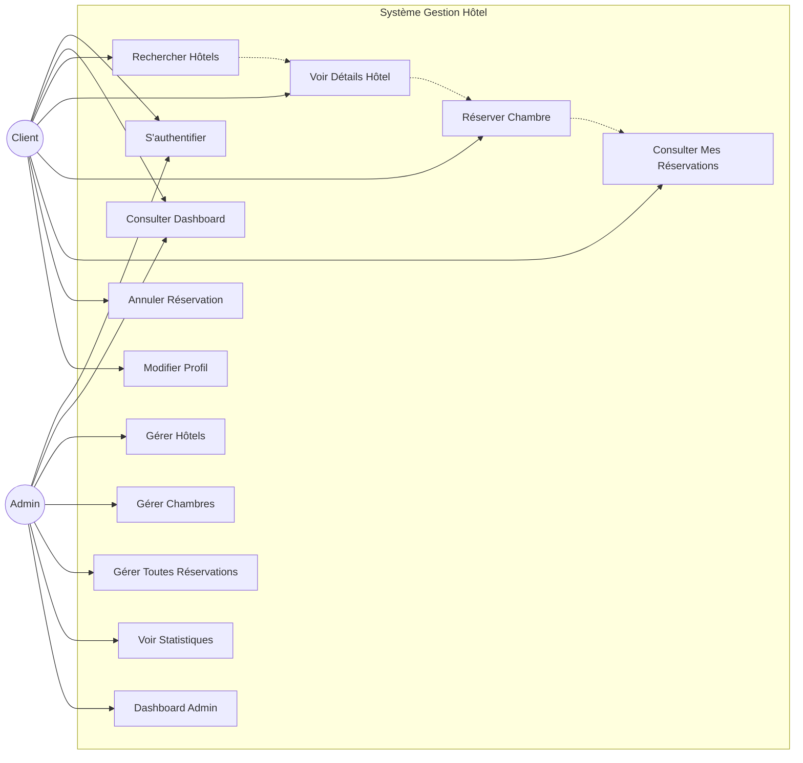
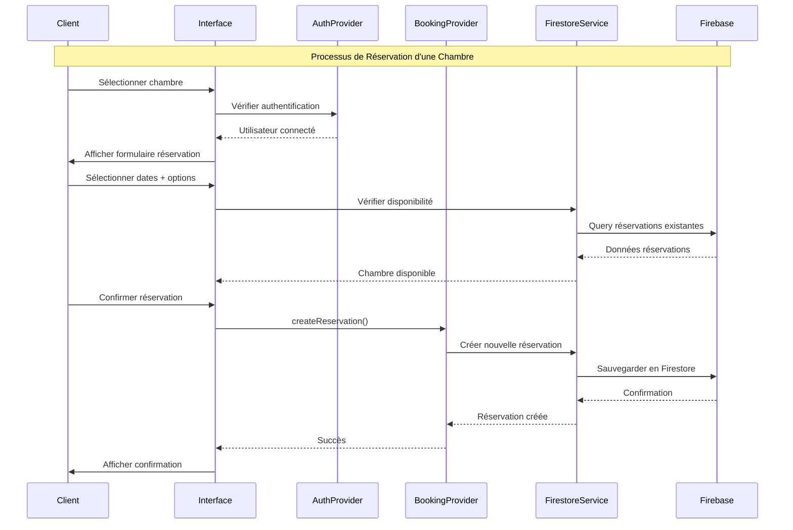
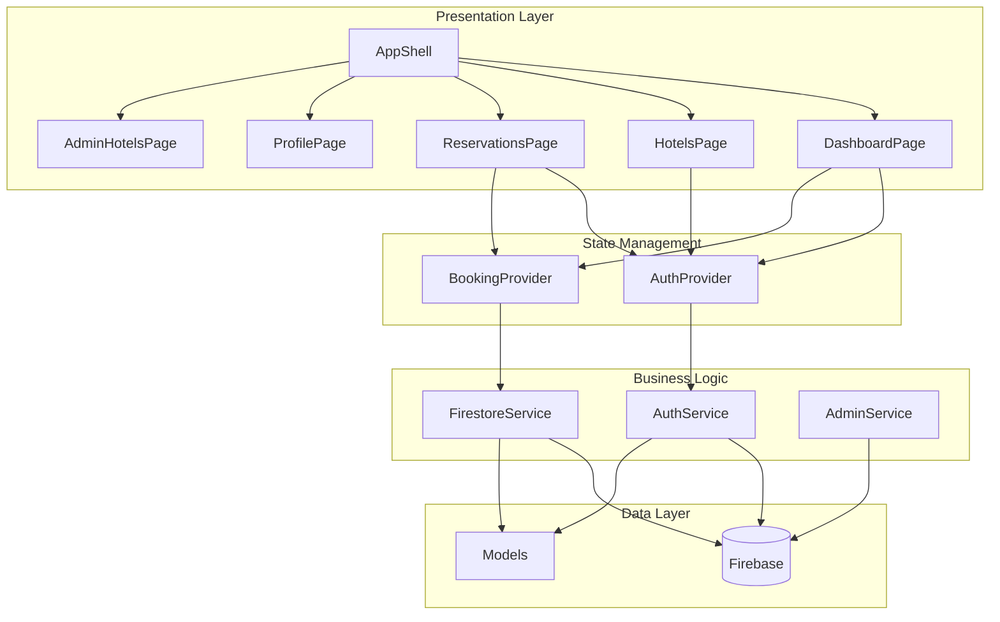

# 📊 Diagrammes UML - Application Gestion Hôtel

## 🎭 Diagramme de Cas d'Utilisation



## 🔄 Diagramme de Séquence - Réservation Chambre



## 🏗️ Diagramme de Classe Simplifié

```mermaid
classDiagram
    class User {
        +String uid
        +String email
        +String role
        +login()
        +logout()
    }
    
    class Hotel {
        +String id
        +String name
        +String address
        +String city
        +double rating
        +List~Room~ rooms
        +getDetails()
    }
    
    class Room {
        +String id
        +String number
        +String type
        +String view
        +int basePrice
        +int viewExtra
        +bool isAvailable
        +checkAvailability()
    }
    
    class Reservation {
        +String id
        +String userId
        +String hotelId
        +String roomId
        +DateTime startDate
        +DateTime endDate
        +String status
        +int totalPrice
        +cancel()
        +confirm()
    }
    
    class AuthProvider {
        +User currentUser
        +bool isAuthenticated
        +login()
        +logout()
        +notifyListeners()
    }
    
    class BookingProvider {
        +bool isLoading
        +String error
        +createReservation()
        +cancelReservation()
        +notifyListeners()
    }
    
    class FirestoreService {
        +getHotels()
        +getRooms()
        +createReservation()
        +getUserReservations()
        +checkRoomAvailability()
    }
    
    %% Relations
    User ||--o{ Reservation : "fait"
    Hotel ||--o{ Room : "contient"
    Hotel ||--o{ Reservation : "reçoit"
    Room ||--o{ Reservation : "est réservée par"
    
    AuthProvider --> User : "gère"
    BookingProvider --> Reservation : "gère"
    BookingProvider --> FirestoreService : "utilise"
    AuthProvider --> FirestoreService : "utilise"
```

## 📱 Architecture des Composants Flutter



## 🎯 Fonctionnalités par Rôle

### 👤 **CLIENT**
- ✅ **Authentification** : Connexion/Déconnexion
- ✅ **Dashboard** : Vue d'ensemble personnalisée
- ✅ **Recherche Hôtels** : Parcourir et filtrer
- ✅ **Détails Hôtel** : Voir chambres et informations
- ✅ **Réservation** : Réserver une chambre avec options
- ✅ **Mes Réservations** : Consulter et gérer ses réservations
- ✅ **Profil** : Modifier ses informations

### 👨‍💼 **ADMIN** 
- ✅ **Dashboard Admin** : Statistiques complètes
- ✅ **Gestion Hôtels** : CRUD complet des hôtels
- ✅ **Gestion Chambres** : CRUD complet des chambres
- ✅ **Gestion Réservations** : Voir/modifier toutes les réservations
- ✅ **Statistiques** : Revenus, occupation, tendances
- ✅ **Filtres Avancés** : Par hôtel, statut, dates

## 🔄 Flux Principal de Réservation

1. **Client se connecte** → AuthProvider vérifie les credentials
2. **Recherche d'hôtel** → HotelsPage affiche la liste
3. **Sélection chambre** → Navigation vers BookRoomScreen
4. **Configuration réservation** → Sélection dates/options
5. **Vérification disponibilité** → FirestoreService vérifie les conflits
6. **Confirmation** → BookingProvider crée la réservation
7. **Sauvegarde** → FirestoreService persiste en Firebase
8. **Notification** → UI affiche le succès

## 📊 Pattern Utilisé: **Provider + Service Layer**

- **Providers** : Gestion d'état réactive (ChangeNotifier)
- **Services** : Logique métier et accès données
- **Features** : Organisation modulaire par fonctionnalité
- **Models** : Structures de données typées

Cette architecture permet une **séparation claire des responsabilités** et une **facilité de maintenance** pour votre projet !